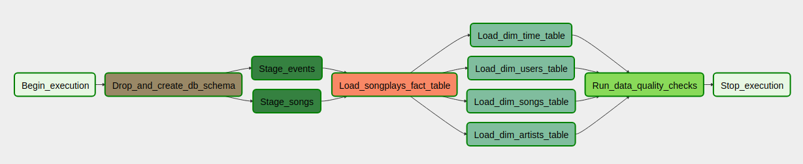

# airflow-pipeline

## Purpose
This projects implements an ETL process including infrastructure setup using AWS for a fictional startup called sparkify.
Their customer growth makes real-time decision-making viable. So they decided to upgrade their systems ETL with an automated data pipeline tooling (here: airflow)
  
It loads customers transaction data (JSON) every hour from an S3 bucket into a redshift cluster, filling a snowflake data schema fit for analytical purposes.
Airflow enables sparkify hourly updates of their analytics system for better and faster analysis and hence decisions.
  
Also in case of error or testing new analytics approaches airflow is able to backfill missing or historic data. 
 
## Outline of approach:
* Using an airflow data pipeline service ETL is executed on regular basis.   
* The source data is located in a S3-Bucket it consists of song_data: containing info about songs listened to and log_data: containing info about songs played by users of sparkify.
* After a redshift cluster has been spun up it is initalized with the creation of a database schema.
* Next airflow can be started. 
* The DAG to copy raw data (log_data into staging_events) and (song_data into staging_songs), insert data into fact table songplays and dimension tables users, artists, songs and time and its subsequent quality check is run every hour or can be triggered manually.

## DAG description:

The DAG (see image below) consits of 7 stages:  
  

  
1. *"Begin_execution"* - a DummyOperator to begin execution:
2. *"Drop_and_create_db_schema"* - operator of type CreateDatabaseSchema (in production: switched of using to_exec=False, can be switched on for debugging or changing the table schema)
3. *"Stage_events"* and *"Stage_songs"* - two StageToRedshiftOperators COPY raw data from S3 source to redshift tables staging_events and staging_songs
4. *"Load_songplays_fact_table"* - a LoadFactOperator loads data from staging_events and staging_songs tables populated in DAG's stage 3 into songplays table
5. *"Load_dim_x_table"* with x = (time, users, songs and artists) - four LoadDimensionOperator load data from staging_events or staging_songs into tables time, users, songs and artists
6. *"Run_data_quality_checks"* - a DataQualityOperator inspects data in non-staging tables whether they have a non-zero count of records (default) or an expected count of records (can be handed to task via expected_counts whose (indices must match indices of table names given via tables parameter)

Below a detailed descriptions of the installation, setup and start process is provided.

## Requirements
* This tutorial assumes a Ubuntu installation (specifically: 18.04)
* Assumes pip is installed
* Assumes a conda/anaconda installation

## How to 

### Install Airflow locally

#### Install and setup Postgresql DB
```
> sudo apt-get install postgresql postgresql-contrib
```
Creating a role:
```
> sudo -u postgres psql
```

Create a Postgres user for airflow (still in psql console)

```
postgres=# CREATE USER <your-user-name> PASSWORD ‘secret’;
CREATE ROLE
postgres=# CREATE DATABASE airflow;
CREATE DATABASE
postgres=# GRANT ALL PRIVILEGES ON ALL TABLES IN SCHEMA public TO <your-user-name>;
GRANT
postgres=# \du
 List of roles
 Role name | Attributes | Member of
 — — — — — -+ — — — — — — — — — — — — — — — — — — — — — — — — — — — — — — + — — — — — -
 <your-user-name> | | {}
 postgres | Superuser, Create role, Create DB, Replication, Bypass RLS | {}
```

Not exit console and check whether database is setup and can be accessed by user <your-user-name>

```
> psql -d airflow
psql (10.10 (Ubuntu 10.10-0ubuntu0.18.04.1))
Type "help" for help.
airflow=> \conninfo
```

You should see something like this:
```
You are connected to database "airflow" as user "<your-user-name> " via socket in "/var/run/postgresql" at port "5432".
airflow=>
```

#### Configure pg_hba.conf and postgresql.conf

##### pg_hba.conf
In order to allow airflow access to Postgres, pg_hba.conf needs to be configured:

```
> sudo nano /etc/postgresql/10/main/pg_hba.conf
```

Change int entry 'IPv4 local connections' the ADDRESS to 0.0.0.0/0 and the METHOD to trust.
In the end there should be:
```
# IPv4 local connections:
TYPE    DATABASE    USER    ADDRESS     METHOD
...
# IPv4 local connections                            <- replace line after this with next line
host    all         all     0.0.0.0/0   trust       <- use this line as replacement
```

You now need to restart Postgres entering:

```
> sudo service postgresql restart
```

##### postgresql.conf

Open postgresql.conf entering:

```
> sudo nano /etc/postgresql/10/main/postgresql.conf
```

Update in the section 'CONNECTIONS AND AUTHENTICATION' listen_addresses from 'localhost' to '*'
```
# — Connection Settings -
#listen_addresses = ‘localhost’     # what IP address(es) to listen on;           <-- before
listen_addresses  = ‘*’             # for Airflow connection                      <-- after
```

And restart Postgres again:
```
> sudo service postgresql restart
```

Based on https://medium.com/@taufiq_ibrahim/apache-airflow-installation-on-ubuntu-ddc087482c14  
Also helpful: https://medium.com/@srivathsankr7/apache-airflow-a-practical-guide-5164ff19d18b

### Install airflow

#### Clone project and conda environment with airflow
```
> cd ~
> git clone https://github.com/genughaben/airflow-pipeline airflow
> cd ~/airflow
> conda create --name airflow python=3.6.6
> conda activate airflow
> pip install -r requirements.txt
```

#### Configure airflow.cfg 
Change paths to match your base-path: i.e. home/<hour-username>/ everywhere applicable:

``` 
(in airflow.cfg)

[core]  

dags_folder = /home/<user_name>/airflow/dags  
base_log_folder = /home/<user_name>/airflow/logs  
sql_alchemy_conn = postgresql+psycopg2://<user_name>@localhost:5432/airflow  
``` 
    
Configure celery as worker backend by seeting:  

```
(in airflow.cfg)
  
[celery]    
broker_url = sqla+postgresql://<user_name>@localhost:5432/airflow  
...  
result_backend = db+postgresql://<user_name>@localhost:5432/airflow  
```

### Setup

#### Setup Redshift cluster

##### .aws
Create an .aws from aws_template
```
> cd ~/airflow/aws_redshift
> cp aws_template .aws
```
Now, open .aws and add your AWS credentials.

##### dwh.cfg
Create an dwh.cfg from dwh-template.cfg

```
> cd ~/airflow/aws_redshift
> cp dwh-template.cfg dwh.cfg 
```  
*NB: Cluster setup works with given values, but you can customize them if you please*


##### Trigger cluster setup
**NB: if you start this, you pay money as for the number of instances outlined in dwh.cfg**  
  
In terminal window
```
> cd aws_redshift
> python setup_redshift 
```

Now, Wait for approx. 5-10min.  
Amongst other info the DWH_ENDPOINT is print out.  
This is required for table schema creation and for a redshift connection in airflow.

##### Create table schema:
* Update DWH_ENDPOINT in ETL, DWH and ENDPOINT section of your dwh.cfg with value from previous step from the terminal
* Update DWH_ROLE in ENDPOINT section of your dwh.cfg with value from previous step from the terminal
* Now, execute:
  
```
> python create_tables.py
```

#### Setup local airflow

##### Start airflow
*Start the following code in three different terminal tabs:*
  
```
> cd 
> conda activate airflow
> sudo service postgresql start
> cd ~/airflow
```

**Now start one of each commands in one of each tabs:**
* Tab 1:
```
> airflow webserver -p 8080
```
* Tab 2:
```
> airflow scheduler
```
* Tab 3:
```
> airflow worker
```

##### Configure Airflow via UI
  
Open your local airflow installation on: localhost:8080/admin  

*Add Connections via Admin -> Connections*

1. Connection: aws_credentials
* Conn ID: aws_credentials
* Conn Type: Amazon Web Services
* Login: your AWS Key
* Password: your AWS secret

2. Connection: redshift
* Conn ID: redshift
* Conn Type: Postgres (might seem strange, but yes, Postgres is correct!)
* Schema: define your scheme (example: dwh_db; must be the same as you provision you AWS redshift instance with)
* Login: define a db user (example: dwh_user; must be the same as you provision you AWS redshift instance with)
* Password: define a db users password (must be the same as you provision you AWS redshift instance with)
* Port 5439


### Start Airflow ETL process

##### trigger manually
* Go to localhost:8080/admin
* Switch the DAG you want to execute "ON"
* Now, click on the trigger symbol (a small play button)
* You can observe the process by clicking on the DAGs name title in the third column and subsequent click on "Graph View"
* Update the view using the "Refresh" Option to see progress

##### configure automatic ETL triggering

* per default the DAG is triggered every hour, but you can change by modifying 'start_date' of the DAG here: ~./airflow/dags/udac_dag.py


## Further Reading
Further reading about airflow and other workflow orchestrators:
* https://github.com/pditommaso/awesome-pipeline
* https://www.quora.com/Which-is-a-better-data-pipeline-scheduling-platform-Airflow-or-Luigi
* https://xunnanxu.github.io/2018/04/13/Workflow-Processing-Engine-Overview-2018-Airflow-vs-Azkaban-vs-Conductor-vs-Oozie-vs-Amazon-Step-Functions/
* https://medium.com/@cyrusv/luigi-vs-airflow-vs-zope-wfmc-comparison-of-open-source-workflow-engines-de5209e6dac1
* Monitoring tool: https://grafana.com/